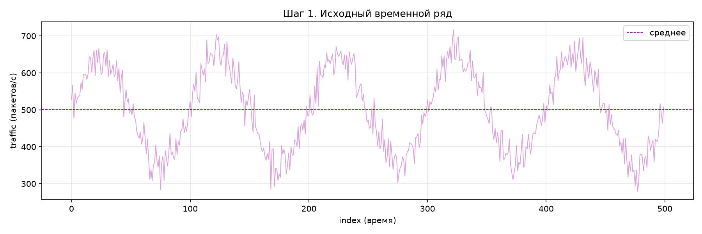
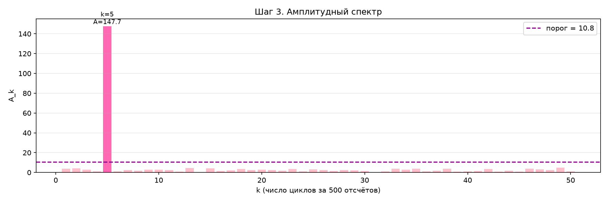
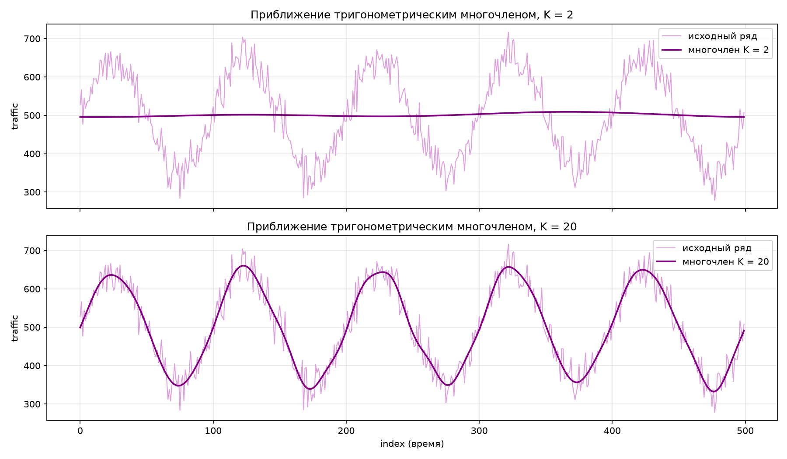

# Отчёт по компьютерной задаче «Спектральный анализ сетевого трафика для обнаружения аномалий»

**Вариант:** 02 (`variant_02.csv`)

Программа: [`task_1/main.py`](task_1/main.py). Запуск из корня репозитория:

```bash
python3 task_1/main.py variant_02.csv
```

Графики сохраняются в `results/`, таблица коэффициентов — в `results/fourier_coefficients.csv`.

---

## 1. Цель работы

Освоить дискретное преобразование Фурье (ДПФ) для анализа временного ряда сетевого трафика и научиться по амплитудному спектру находить аномальные частотные компоненты, а именно: признаки DDoS-атаки, ботнета, сканирования портов или скрытого канала.

## 2. Теоретическая часть

### 2.1. Спектральный анализ

Любой ряд из $N$ точек можно записать как сумму постоянной составляющей и гармоник — синусов и косинусов с частотами $k$ циклов за весь период наблюдения. Гармоника с номером $k$ имеет период $N/k$ отсчётов. Спектральный анализ находит, какие гармоники присутствуют в сигнале и насколько они сильны. Периодический процесс, незаметный во времени из-за шума, в спектре проявляется как отдельный пик на своей частоте.

### 2.2. Формулы ДПФ

Для ряда $T(0), T(1), \dots, T(N-1)$:

$$\frac{a_0}{2} = \frac{1}{N}\sum_{j=0}^{N-1} T(j)$$

$$
a_k = \frac{2}{N}\sum_{j=0}^{N-1} T(j)\cos\left(\frac{2\pi k j}{N}\right), \qquad
b_k = \frac{2}{N}\sum_{j=0}^{N-1} T(j)\sin\left(\frac{2\pi k j}{N}\right)
$$

$$A_k = \sqrt{a_k^2 + b_k^2}$$

$a_0/2$ — среднее значение ряда. $a_k$ и $b_k$ показывают, насколько сигнал похож на косинус и синус частоты $k$, а $A_k$ — полная амплитуда гармоники независимо от её сдвига по времени. Множитель $2/N$ подобран так, чтобы для чистой волны $C\cos\frac{2\pi k j}{N}$ получалось ровно $a_k = C$.

### 2.3. Тригонометрический многочлен порядка K

$$T(t) \approx \frac{a_0}{2} + \sum_{k=1}^{K}\left(a_k\cos\frac{2\pi k t}{N} + b_k\sin\frac{2\pi k t}{N}\right)$$

### 2.4. Критерий аномалии

У нормального трафика есть большой пик на $k = 1$ (суточный цикл), возможно на $k = 2$ (утренний и вечерний пики), а на высоких $k$ амплитуды малы. Аномалия — это гармоника, амплитуда которой резко выделяется на фоне остальных.

В программе используется **робастный порог** через медиану и медианное абсолютное отклонение (MAD):

$$A_k > \text{med}(A) + 5 \cdot 1.4826 \cdot \text{MAD}(A), \qquad \text{MAD}(A) = \text{med}\big|A_k - \text{med}(A)\big|.$$

Множитель 1.4826 переводит MAD в оценку СКО для нормального распределения. Почему не обычное правило $\overline{A} + 3\sigma_A$: сильный пик сам раздувает среднее и СКО, и порог «уезжает» вверх вслед за аномалией. Медиана и MAD от одного-двух выбросов почти не меняются, поэтому описывают именно фон.

## 3. Результаты

### Шаг 1. Исходный ряд



| Характеристика     | Значение               |
| ------------------ | ---------------------- |
| Число точек $N$    | 500                    |
| Среднее            | 500.95 пакетов/с       |
| СКО                | 108.45                 |
| Минимум / максимум | 278.47 / 716.31        |
| Линейный тренд     | −0.099 пакета/с на отсчёт |

**Что видно на графике.** Ряд не похож на случайный шум: он регулярно качается между ≈ 350 и ≈ 650 пакетами/с.

- **Явная периодичность:** за 500 отсчётов укладывается ровно **5 одинаковых волн**. Максимумы около отсчётов 25, 125, 225, 325, 425, минимумы около 75, 175, 275, 375, 475. Период ≈ 100 отсчётов.
- **Тренда нет:** наклон прямой −0.1 пакета/с на отсчёт, то есть за весь ряд уровень меняется на ≈ 50 при размахе волн ≈ 300 — это следствие того, что ряд обрывается на подъёме, а не реальный рост или спад. Средние по блокам из 50 отсчётов строго чередуются: ≈ 590, ≈ 405, ≈ 596, ≈ 405, … без дрейфа.
- **Поверх волны — шум** с размахом примерно ±30–50.
- **Суточного цикла нет:** одной большой волны «день/ночь» на всём ряду не видно.
- Соседние точки сильно связаны: автокорреляция с лагом 1 равна 0.92 (у чистого шума было бы ≈ 0). Это тоже признак плавной регулярной составляющей.

СКО ряда (108) почти в 4 раза больше, чем у «спокойного» трафика с таким же шумом (≈ 29): основной разброс создаёт именно волна.

### Шаг 2. Коэффициенты Фурье

Постоянная составляющая: $a_0/2 = 500.955$ (совпадает со средним).

Коэффициенты считаются в программе напрямую по формулам п. 2.2, без готовых функций БПФ. Строка $k = 5$ выделена: её амплитуда на два порядка больше остальных.

<details>
<summary>Полная таблица коэффициентов k = 1..50</summary>

|   k |  $a_k$ |  $b_k$ | $A_k$ |
| --: | -----: | -----: | ----: |
|   1 | −1.172 | −3.716 | 3.896 |
|   2 | −4.282 | 0.470 | 4.308 |
|   3 | −2.821 | −0.704 | 2.907 |
|   4 | 1.002 | −0.084 | 1.005 |
| **5** | **2.170** | **147.683** | **147.699** |
|   6 | −1.014 | −0.442 | 1.106 |
|   7 | −2.241 | −1.155 | 2.521 |
|   8 | 0.723 | 1.767 | 1.909 |
|   9 | 2.846 | 0.293 | 2.861 |
|  10 | 1.068 | 2.714 | 2.917 |
|  11 | 2.369 | 0.147 | 2.373 |
|  12 | 0.643 | −0.174 | 0.666 |
|  13 | 4.429 | 0.342 | 4.442 |
|  14 | −0.264 | 0.318 | 0.413 |
|  15 | −2.598 | −3.228 | 4.144 |
|  16 | −0.218 | −1.287 | 1.305 |
|  17 | 2.065 | −0.399 | 2.103 |
|  18 | −3.337 | −1.077 | 3.506 |
|  19 | 1.925 | −1.249 | 2.294 |
|  20 | −2.938 | 0.042 | 2.938 |
|  21 | −1.136 | 2.373 | 2.631 |
|  22 | −1.184 | 1.225 | 1.703 |
|  23 | 2.126 | −2.775 | 3.495 |
|  24 | −0.786 | 0.896 | 1.192 |
|  25 | 3.181 | 0.128 | 3.184 |
|  26 | 2.469 | 0.610 | 2.543 |
|  27 | 0.039 | 1.530 | 1.530 |
|  28 | 2.592 | 0.023 | 2.592 |
|  29 | 1.229 | −1.568 | 1.992 |
|  30 | 1.268 | 0.305 | 1.304 |
|  31 | 0.030 | −0.208 | 0.210 |
|  32 | −0.098 | 0.978 | 0.983 |
|  33 | 3.668 | −0.835 | 3.762 |
|  34 | 2.238 | 1.425 | 2.653 |
|  35 | 0.616 | −3.767 | 3.817 |
|  36 | 0.617 | 0.802 | 1.012 |
|  37 | 1.661 | −0.446 | 1.720 |
|  38 | −2.387 | −3.103 | 3.914 |
|  39 | 0.877 | −0.303 | 0.928 |
|  40 | 1.133 | 0.454 | 1.221 |
|  41 | −0.889 | 1.121 | 1.431 |
|  42 | 3.541 | −0.821 | 3.635 |
|  43 | 0.484 | 0.612 | 0.780 |
|  44 | −1.758 | −0.189 | 1.768 |
|  45 | −0.309 | 0.734 | 0.796 |
|  46 | −2.605 | −2.689 | 3.744 |
|  47 | −0.930 | −3.069 | 3.206 |
|  48 | 2.021 | −1.191 | 2.346 |
|  49 | 4.844 | 0.160 | 4.847 |
|  50 | 0.937 | 0.567 | 1.095 |

</details>

### Шаг 3. Амплитудный спектр



Шесть наибольших гармоник:

| Место |   k |   $A_k$ | Период, отсчётов ($N/k$) |
| ----: | --: | ------: | -----------------------: |
|     1 |   5 | **147.70** |                  **100** |
|     2 |  49 |    4.85 |                   ≈ 10.2 |
|     3 |  13 |    4.44 |                   ≈ 38.5 |
|     4 |   2 |    4.31 |                      250 |
|     5 |  15 |    4.14 |                   ≈ 33.3 |
|     6 |  38 |    3.91 |                   ≈ 13.2 |

Статистика амплитуд $k = 1..50$: медиана $= 2.36$, MAD $= 1.14$, порог $= 2.36 + 5 \cdot 1.4826 \cdot 1.14 = 10.79$.

Порог превышает **одна гармоника — $k = 5$, $A_5 = 147.70$**. Она больше медианы фона в 63 раза и даёт 57 % суммы всех 50 амплитуд. Все остальные 49 гармоник лежат в диапазоне 0.2–4.85, то есть в 2–3 раза ниже порога и в 30 с лишним раз ниже пика.

Пик почти целиком синусный: $b_5 = 147.68$, а $a_5 = 2.17$. Значит, волна имеет вид $\approx 147.7\,\sin\frac{2\pi \cdot 5 t}{500} = 147.7\,\sin\frac{2\pi t}{100}$, то есть начинается от среднего уровня и идёт вверх, что видно и на графике шага 1.

Суточного пика на $k = 1$ нет: $A_1 = 3.90$ — на уровне фона.

**Проверка порога другим способом.** Обычное правило трёх сигм по всем 50 амплитудам даёт $\overline{A} + 3\sigma_A = 5.23 + 3 \cdot 20.39 = 66.39$. $k = 5$ проходит и его, но порог вырос в 6 раз из-за самого пика ($\sigma_A$ подскочило с 1.20 до 20.39). Если бы аномалия была слабее, например $A = 40$, правило трёх сигм её бы пропустило, а робастный порог 10.8 — нет. Если же посчитать среднее и СКО фона без $k = 5$ ($2.32$ и $1.20$), то пик выше среднего фона на $\approx 121\sigma$.

### Шаг 4. Анализ аномалий

**Есть ли в спектре аномальные пики?** Да, один, очень сильный.

**На каких k они находятся?** На $k = 5$: ровно 5 полных колебаний за 500 отсчётов, период $N/k = 500/5 = 100$ отсчётов. При посекундной записи — раз в 100 секунд (≈ 1 мин 40 с).

**Насколько он силён.**

- Амплитуда 147.7 пакетов/с при среднем уровне 501: трафик качается примерно от 353 до 649, то есть на ±30 % от среднего.
- По равенству Парсеваля гармоника несёт долю дисперсии $\dfrac{A_5^2/2}{\sigma^2} = \dfrac{147.7^2/2}{108.45^2} \approx 93\%$. Почти весь разброс ряда объясняется одной этой волной.

**Что остаётся без неё — проверка по модели белого шума.** Если вычесть из ряда среднее и гармонику $k = 5$, остаток имеет СКО $\approx 29.2$. Для независимого шума с таким СКО коэффициенты $a_k$, $b_k$ имеют СКО $29.2\sqrt{2/N} \approx 1.85$, а амплитуды распределены по Рэлею:

| Величина (фон, без $k = 5$)       |                           Теория для шума | Факт |
| --------------------------------- | ----------------------------------------: | ---: |
| Средняя амплитуда                 |           $1.85\sqrt{\pi/2} \approx 2.32$ | 2.32 |
| Ожидаемый максимум из 49 амплитуд | $\approx 1.85\sqrt{2\ln 49} \approx 5.16$ | 4.85 |

Совпадение полное. Значит, ряд устроен так: **постоянный уровень ≈ 500 + одна синусоида с периодом 100 + белый шум с СКО ≈ 29**. Других регулярных составляющих нет.

**Что это может означать?**

1. **Нормальный суточный цикл исключается.** Он дал бы пик на $k = 1$, а не на $k = 5$. За время наблюдения укладывается ровно 5 одинаковых волн — это слишком часто и слишком регулярно для поведения пользователей.
2. **Строгая периодичность — признак автоматического источника.** Наиболее вероятные интерпретации:
   - **ботнет** — заражённые узлы синхронно, по таймеру, выходят на связь с сервером управления (C&C beaconing) или запускают волны нагрузки каждые 100 с;
   - **пульсирующая DDoS-атака** (pulse-wave DDoS) — нагрузка подаётся «волнами» с фиксированным периодом, чтобы перегружать цель и обходить пороговые детекторы, рассчитанные на постоянный всплеск;
   - **скрытый канал** — данные кодируются в изменении интенсивности трафика с фиксированным тактом;
   - **регулярное сканирование** — повторяющийся цикл перебора адресов или портов.
3. **Что говорит против простого DDoS.** Средний уровень не вырос (≈ 501, как у нормального ряда), длительного всплеска нет: средние по блокам из 50 отсчётов чередуются ≈ 590 / ≈ 405 весь ряд без изменения. Это «качели» вокруг нормы, а не рост нагрузки. Поэтому вероятнее ботнет с периодической активностью или пульсирующая атака.
4. **Безобидный вариант, который тоже стоит проверить:** легитимная периодическая задача (резервное копирование, синхронизация, мониторинг по cron). По одному спектру их не отличить, нужен разбор адресов и портов в интервалы пиков (около отсчётов 25, 125, 225, 325, 425).

**Вывод по шагу 4:** в трафике варианта 02 обнаружена аномальная гармоника $k = 5$ (период 100 отсчётов) с амплитудой 147.7, превышающей фон в 63 раза и объясняющей ≈ 93 % дисперсии. Такая строгая периодичность характерна для ботнета или пульсирующей атаки и требует расследования.

### Шаг 5. Тригонометрические многочлены



Качество приближения оценено по среднеквадратичной ошибке и коэффициенту детерминации:

$$\text{RMSE} = \sqrt{\frac{1}{N}\sum_{t}\big(T(t) - \hat T(t)\big)^2}, \qquad R^2 = 1 - \frac{\sum (T - \hat T)^2}{\sum (T - \overline{T})^2}$$

| Модель                         |   RMSE |  $R^2$ |
| ------------------------------ | -----: | -----: |
| Только среднее ($a_0/2$)       | 108.45 |    0 % |
| K = 2                          | 108.37 |  0.1 % |
| Среднее + только $k = 5$       |  29.22 | 92.7 % |
| K = 5                          |  28.85 | 92.9 % |
| K = 20                         |  27.94 | 93.4 % |

Строки «только $k = 5$» и «K = 5» добавлены для сравнения и в программе не выводятся.

**Сравнение.**

- **K = 2** — почти горизонтальная линия около 500. Многочлен содержит только гармоники $k = 1, 2$, а они на уровне шума. Главную волну $k = 5$ он **не видит вообще**, поэтому ошибка (108.37) практически равна ошибке простого среднего (108.45).
- **K = 20** — кривая точно повторяет 5 колебаний ряда, ошибка упала в 3.9 раза, до 27.94. Остаток ≈ 28–29 — это и есть уровень белого шума, ниже которого опускаться бессмысленно.

**Какой порядок лучше описывает данные?** Из двух заданных — **K = 20**: только он включает гармонику $k = 5$, в которой и сосредоточена вся структура ряда.

При этом почти вся заслуга K = 20 — одна гармоника. Модель «среднее + $k = 5$» даёт RMSE 29.22, а остальные 19 гармоник уменьшают ошибку всего на 1.3 (≈ 0.7 % дисперсии, для шума ожидалось бы около $38/500 \approx 7.6\%$ от остатка, то есть те же ≈ 0.6 % от исходной дисперсии). То есть гармоники кроме $k = 5$ подгоняются под шум. Минимальная достаточная модель — K = 5 (или одна гармоника $k = 5$).

Этот шаг наглядно показывает, что порядок многочлена надо выбирать по спектру, а не «чем меньше, тем проще»: низкий порядок, который не доходит до значимой частоты, бесполезен.

## 4. Выводы

1. Ряд варианта 02: среднее 500.95 пакетов/с, СКО 108.45, диапазон 278–716. Тренда нет (наклон −0.1 пакета/с на отсчёт), но на графике отчётливо видны 5 одинаковых волн с периодом ≈ 100 отсчётов.
2. В амплитудном спектре один резкий пик: **$k = 5$, $A_5 = 147.7$**, при робастном пороге 10.79 и медиане фона 2.36 (в 63 раза выше фона). Остальные 49 гармоник совпадают с теорией для белого шума.
3. Пик соответствует строго периодическому процессу с периодом 100 отсчётов, на который приходится ≈ 93 % дисперсии. Суточного цикла ($k = 1$) нет. Такая периодичность характерна для **ботнета или пульсирующей (pulse-wave) DDoS-атаки**; трафик требует расследования по адресам и портам в моменты пиков.
4. Многочлен K = 2 не захватывает гармонику $k = 5$ и бесполезен (RMSE 108.37 ≈ СКО ряда). K = 20 описывает данные хорошо (RMSE 27.94, $R^2 = 0.93$), но почти весь эффект даёт одна гармоника $k = 5$; остаток — шум с СКО ≈ 29.
